# SmartShopAI VLM 识图找货流程

## 流程图

```mermaid
flowchart TD
    A[用户在 AI 导购页点击相机] --> B[ChatScreen 创建缓存图片 URI]
    B --> C[FileProvider 授权相机写入]
    C --> D[ActivityResultContracts.TakePicture 拍照]
    D -->|成功| E[ChatViewModel.sendMessage imageUri]
    D -->|取消或失败| X1[不发送消息]

    E --> F[AiChatDataSource.describeImage]
    F --> G[ML Kit 生成端侧轻量标签 hint]
    G --> H[uploadAgentImage 上传图片]
    H --> I[POST /api/agent/image/upload]
    I --> J{save_upload 校验}
    J -->|非 jpeg/png/webp| X2[415 拒绝]
    J -->|超过 8MB| X3[413 拒绝]
    J -->|通过| K[保存到 backend/data/uploads]
    K --> L[写入 uploaded_images 表]
    L --> M[返回 image_id]

    M --> N[POST /api/agent/chat/stream]
    N --> O[_stream_chat 收到 message + image_id]
    O --> P[analyze_uploaded_image]
    P --> Q{是否有可复用缓存}
    Q -->|有缓存且无新 hint| R[读取 detected_json 和 query]
    Q -->|无缓存或有新 hint| S[加载商品库 taxonomy]
    S --> T[vision_client.analyze_image_file_with_vlm]
    T --> U[图片转 base64 data URL]
    U --> V[调用 OpenAI-compatible VLM]
    V --> W{VLM 返回是否有效}
    W -->|有效 JSON| Y[解析 objects 1 到 3 个候选]
    W -->|未配置/超时/非 JSON| Z[mock_detect_from_hint fallback]
    Y --> AA[normalize_image_object 规整字段]
    Z --> AA
    AA --> AB[build_image_analysis_query 生成图片宽 query]
    AB --> AC[更新 uploaded_images detected_json/query]

    AC --> AD[retrieve_image_match_products]
    AD --> AE[对每个 object 生成 candidate query]
    AE --> AF[search_products_for_agent_with_diagnostics]
    AF --> AG[image_wide_match 策略]
    AG --> AH[类目/子类目只加权 不硬过滤]
    AH --> AI[dense Milvus 语义召回]
    AH --> AJ[BM25 文本召回]
    AH --> AK[keyword 关键词加权]
    AI --> AL[RRF 融合]
    AJ --> AL
    AK --> AL
    AL --> AM[SQLite hydrate 商品事实]
    AM --> AN[verifier 过滤库存/价格/强约束]
    AN --> AO[score_image_product_match]
    AO --> AP[融合多候选 去重 排序]
    AP --> AQ{匹配等级}
    AQ -->|高一致| AR[exact_like]
    AQ -->|相近| AS[similar]
    AQ -->|无可靠结果| AT[no_match]

    AR --> AU[SSE image_analysis]
    AS --> AU
    AT --> AU
    AU --> AV[SSE retrieval_status / diagnostics]
    AV --> AW[SSE products 或 alternatives]
    AW --> AX[stream_grounded_answer_events 生成导购回复]
    AX --> AY[SSE actions]
    AY --> AZ[SSE done]

    AZ --> BA[Android 解析 image_analysis 提示]
    BA --> BB[Android 展示商品卡片和 AI 回复]
```

## 当前实现要点

- Android 侧入口在 `ChatScreen`：拍照成功后调用 `sendMessage(imageUri=...)`，不走独立识图页。
- 图片上传先经过 `save_upload`，限制格式为 `jpeg/png/webp`，大小不超过 `8MB`。
- VLM 入口在 `vision_client.analyze_image_file_with_vlm`，默认复用 `POE_API_KEY/POE_BASE_URL/LLM_MODEL`，也支持独立 `VLM_*` 配置。
- VLM 不直接推荐商品，只输出最多 3 个可购物物体候选和检索属性。
- 随手拍场景使用 `image_wide_match`：VLM 类目参与加权，但不会在初始召回阶段硬过滤。
- 商品匹配仍复用现有 `dense Milvus + BM25 + keyword -> RRF -> SQLite hydrate -> verifier`。
- 后端通过 `image_analysis` SSE 先告诉前端识别到了什么，再通过 `products` SSE 返回商品卡片。

## 关键文件

- `app/src/main/java/com/smartshop/ai/ui/chat/ChatScreen.kt`
- `app/src/main/java/com/smartshop/ai/data/chat/AiChatDataSource.kt`
- `backend/app/main.py`
- `backend/app/agent.py`
- `backend/app/vision_client.py`
- `backend/app/rag.py`
